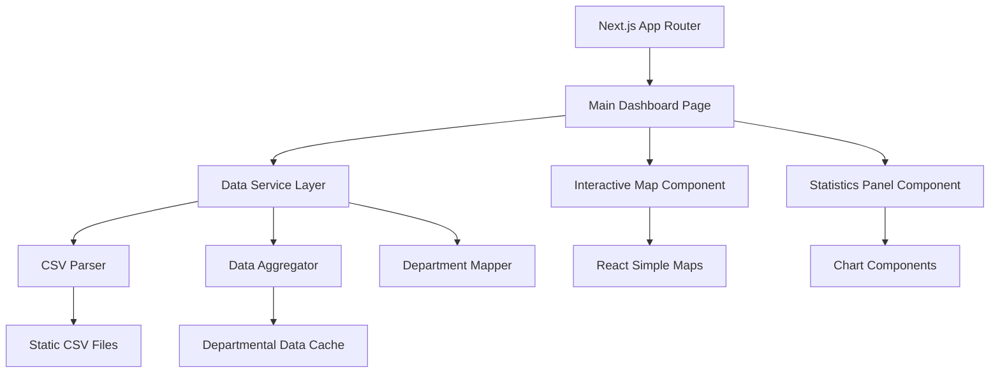

# Design Document

## Overview

The Vaccination and Flu Dashboard is a Next.js-based web application that provides an interactive map-centric visualization of French vaccination coverage and flu surveillance data. The design follows humanitarian dashboard principles with a prominent map of French departments and supporting statistics panel, eliminating complex filtering interfaces in favor of immediate, clear data presentation.

### Key Design Principles
- **Map-First**: Interactive map as the primary visualization element showing departmental data
- **Immediate Clarity**: No complex filters - data is immediately visible and understandable
- **Humanitarian Style**: Clean, professional design similar to crisis response dashboards
- **Geographic Focus**: Department-level granularity with hover and click interactions
- **Responsive Design**: Optimized for desktop viewing with mobile compatibility

## Architecture

### High-Level Architecture



### Technology Stack
- **Frontend**: Next.js 15 with App Router, React 19, TypeScript
- **Styling**: Tailwind CSS with humanitarian dashboard color palette
- **Map Library**: React Simple Maps for French department visualization
- **Charts**: Recharts for statistics panel charts and indicators
- **Data Processing**: Custom CSV parser with departmental aggregation
- **State Management**: React useState for map/statistics synchronization
- **Deployment**: Vercel (optimized for static data)

## Components and Interfaces

### Core Components

#### 1. Data Service Layer
```typescript
interface DataService {
  loadVaccinationData(): Promise<VaccinationData[]>
  loadFluData(): Promise<FluData[]>
  validateDataIntegrity(): Promise<ValidationResult>
  getAvailableYears(): string[]
  getAvailableRegions(): Region[]
}
```

#### 2. Vaccination Data Models
```typescript
interface VaccinationCampaignData {
  campagne: string
  date: string
  variable: 'ACTE(VGP)' | 'DOSES(J07E1)' | 'UNIVERS' | 'PHARMACIES'
  valeur: number
  cible: number
}

interface VaccinationCoverageData {
  region: string
  code: string
  variable: 'ACTE(VGP)' | 'DOSES(J07E1)'
  groupe: '65 ans et plus' | 'moins de 65 ans'
  valeur: number
}
```

#### 3. Flu Surveillance Data Models
```typescript
interface FluSurveillanceData {
  premierJourSemaine: string
  semaine: string
  classeAge: string
  tauxPassagesUrgences: number
  tauxHospitalisations: number
  tauxActesSOS: number
  departement?: string
  region?: string
}
```

#### 4. Map and Statistics Components
```typescript
interface InteractiveMapProps {
  data: DepartmentData[]
  selectedDepartment: string | null
  onDepartmentSelect: (departmentCode: string) => void
  dataType: 'vaccination' | 'flu'
  colorScale: ColorScale
}

interface StatisticsPanelProps {
  selectedDepartment: string | null
  nationalData: NationalStats
  departmentData: DepartmentStats | null
  dataType: 'vaccination' | 'flu'
}
```

### Page Structure

#### Dashboard Layout
- **Header**: Title, data toggle (Vaccination/Flu), and last updated indicator
- **Main Content**: Two-column layout with map (70%) and statistics panel (30%)
- **Footer**: Data sources and methodology information

#### Interactive Map Section (Left Column)
- **French Departments Map**: Color-coded departments based on vaccination coverage or flu activity
- **Hover Tooltips**: Department name, key metric, and population
- **Click Interaction**: Selects department and updates statistics panel
- **Legend**: Color scale explanation and data ranges

#### Statistics Panel (Right Column)
- **Profile Section**: Selected department info or national overview
- **Key Metrics**: Large numbers showing coverage percentages, population counts
- **Demographics**: Age group breakdowns with icons and simple charts
- **Trend Indicators**: Simple up/down arrows showing progress over time
- **Comparison Charts**: Selected department vs. national average

## Data Models

### Data Processing Pipeline

1. **CSV Loading**: Automatic detection and loading of all CSV files in `/data` directory
2. **Data Validation**: Type checking, range validation, and completeness assessment
3. **Data Transformation**: Standardization of date formats, numeric parsing, and aggregation
4. **Caching**: In-memory caching of processed data for performance
5. **Error Handling**: Graceful degradation with partial data availability

### Data Aggregation Strategies

#### Departmental Data Aggregation
- **Geographic**: Aggregate all data by French department codes (01-95, 2A, 2B)
- **Vaccination Metrics**: Calculate coverage percentages by age group per department
- **Flu Metrics**: Aggregate emergency visits and SOS consultations by department
- **Population Data**: Maintain department population for per-capita calculations

#### Map Visualization Data
- **Color Coding**: 5-level color scale from low to high coverage/activity
- **Tooltip Data**: Department name, primary metric, population, rank
- **National Comparison**: Each department's position relative to national average
- **Missing Data Handling**: Gray color for departments with insufficient data

## Error Handling

### Data Quality Management
- **Missing Files**: Graceful degradation with available datasets
- **Corrupt Data**: Row-level error isolation with reporting
- **Format Issues**: Automatic type coercion with validation warnings
- **Performance**: Lazy loading and pagination for large datasets

### User Experience
- **Loading States**: Progressive loading with skeleton screens
- **Error Messages**: Clear, actionable error descriptions
- **Fallback Content**: Default visualizations when data is unavailable
- **Retry Mechanisms**: Automatic retry for transient failures

## Testing Strategy

### Core Testing Approach
- **Unit Tests**: Data parsing, validation, and transformation logic
- **Integration Tests**: CSV loading and data service functionality
- **Component Tests**: Chart rendering and interaction behavior
- **E2E Tests**: Critical user journeys through the dashboard

### Test Data Strategy
- **Sample Datasets**: Reduced CSV files for fast test execution
- **Mock Data**: Generated test data for edge cases
- **Validation Tests**: Data integrity and format compliance
- **Performance Tests**: Large dataset handling and rendering speed

### Testing Tools
- **Jest**: Unit and integration testing
- **React Testing Library**: Component testing
- **Playwright**: End-to-end testing
- **MSW**: API mocking for future LLM integration

## Performance Considerations

### Data Loading Optimization
- **Streaming**: Progressive CSV parsing for large files
- **Caching**: Browser and server-side caching strategies
- **Compression**: Gzip compression for CSV files
- **Lazy Loading**: On-demand data loading based on user interaction

### Rendering Performance
- **Virtualization**: Virtual scrolling for large datasets
- **Debouncing**: Filter and search input debouncing
- **Memoization**: React.memo and useMemo for expensive calculations
- **Code Splitting**: Route-based and component-based code splitting

## Accessibility Features

### WCAG 2.1 Compliance
- **Keyboard Navigation**: Full keyboard accessibility for all interactive elements
- **Screen Readers**: Proper ARIA labels and semantic HTML structure
- **Color Contrast**: High contrast ratios meeting AA standards
- **Focus Management**: Clear focus indicators and logical tab order

### Map and Chart Accessibility
- **Alternative Text**: Descriptive alt text for map and all visualizations
- **Keyboard Navigation**: Tab navigation through departments and statistics
- **Screen Reader Support**: ARIA labels for map regions and data values
- **High Contrast**: Color scales that work for colorblind users
- **Data Tables**: Alternative tabular view of departmental data

## Future Enhancements (Optional)

### Enhanced Interactivity
- **Time Slider**: Animate changes over time (2021-2024)
- **Multi-Department Selection**: Compare multiple departments simultaneously
- **Export Functionality**: PNG export of map and statistics
- **Zoom and Pan**: Detailed view of specific regions

### Additional Data Views
- **Regional Grouping**: Toggle between department and region-level data
- **Demographic Overlays**: Show age group data directly on the map
- **Trend Animations**: Animated transitions showing data evolution
- **Comparison Mode**: Side-by-side vaccination vs. flu activity maps